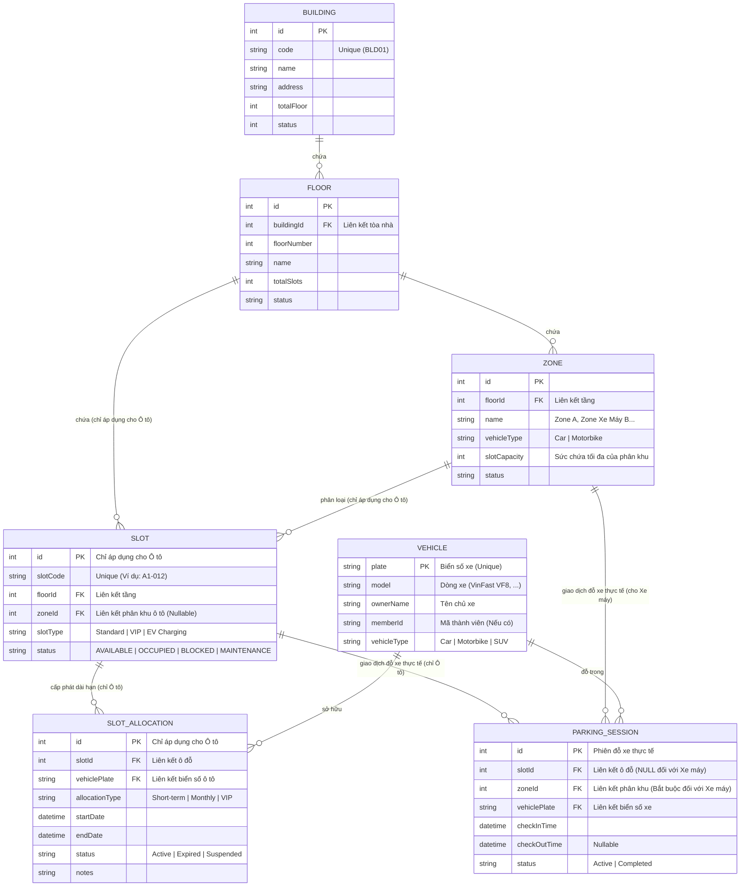

# Thiết kế Cấu trúc Dữ liệu cho Quản lý Chỗ đỗ (Slot Management)

Tài liệu này đề xem xét và đề xuất mô hình thực thể cơ sở dữ liệu (Database Schema) cùng các API payload cần thiết để triển khai tính năng **Slot Management (Quản lý chỗ đỗ)** theo đúng tài liệu đặc tả SRS.

### ⚠️ Lưu ý nghiệp vụ quan trọng:
* **Ô tô (Car/SUV):** Quản lý chi tiết đến từng **Slot (Ô đỗ)** cố định. Có đầy đủ trạng thái trống/bận, hỗ trợ cấp phát dài hạn (vé tháng) và gán xe thực tế vào từng ô đỗ.
* **Xe máy (Motorbike):** **Không quản lý theo Slot**. Xe máy chỉ đỗ tự do trong các phân khu chung (**Zone** dành riêng cho xe máy). Hệ thống chỉ kiểm soát tổng dung lượng (Capacity) và đếm số lượng xe máy đang đỗ tại phân khu đó.
* **Quyền ưu tiên đỗ xe tháng:** Quyền giữ slot cho xe tháng được kiểm soát ở cấp độ logic thông qua cột `monthly_subscription.assigned_slot_id`. Trạng thái của Slot (`slot_status`) không dùng để biểu diễn việc đặt chỗ dài hạn mà chỉ phản ánh đúng tình trạng vật lý/vận hành của ô đỗ.

---

## 1. Sơ đồ Quan hệ Thực thể (ERD)

Dưới đây là sơ đồ mối quan hệ giữa các bảng để hỗ trợ việc phân cấp chỗ đỗ và theo dõi phương tiện:

---

## 2. Chi tiết các Bảng dữ liệu chính

### A. Thực thể Ô đỗ (Slot) - *Chỉ dành cho Ô tô*
Ô đỗ thừa hưởng gián tiếp từ **Building** và trực tiếp từ **Floor** / **Zone**.

| Tên trường (Field) | Kiểu dữ liệu | Ràng buộc | Mô tả |
| :--- | :--- | :--- | :--- |
| `Id` | `int` | Primary Key, Auto-increment | ID định danh duy nhất của ô đỗ. |
| `SlotCode` | `string` | Unique, Required | Mã hiển thị trực quan (Ví dụ: `A1-012` hoặc `B1-VIP-05`). |
| `FloorId` | `int` | Foreign Key (`Floor.Id`) | Thuộc về tầng nào. |
| `ZoneId` | `int` | Foreign Key (`Zone.Id`), Nullable | Thuộc về phân khu ô tô nào (Ví dụ: Khu VIP, Khu sạc điện EV). |
| `SlotType` | `string` | Required | Loại ô đỗ (`Standard`, `VIP`, `EV Charging`). *Không có loại Motorbike*. |
| `Status` | `string` | Required | Trạng thái hiện tại: `AVAILABLE` (trống), `OCCUPIED` (đang có xe đỗ), `BLOCKED` (bị khóa), `MAINTENANCE` (đang bảo trì). |

---

## 3. Quản lý Trạng thái Slot (slot_status)

Theo tài liệu đặc tả SRS, trạng thái của Slot (`slot_status`) không dùng để biểu diễn việc giữ chỗ của Monthly Subscription. Thay vào đó, **`slot_status` chỉ đại diện cho trạng thái vật lý/vận hành thực tế** của ô đỗ và có đúng **4 giá trị**:

1. **`AVAILABLE`**: Chỗ trống, sẵn sàng cho xe vào đỗ hoặc đỗ theo lịch đặt (Booking).
2. **`OCCUPIED`**: Đang có phương tiện đỗ thực tế (có phiên đỗ xe `Active` tại ô đó).
3. **`BLOCKED`**: Bị khóa thủ công do quản lý chỉ định (không khả dụng cho đỗ xe).
4. **`MAINTENANCE`**: Đang bảo trì thiết bị hoặc cảm biến (không khả dụng cho đỗ xe).
